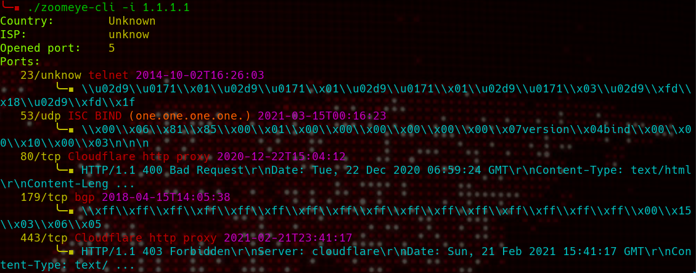
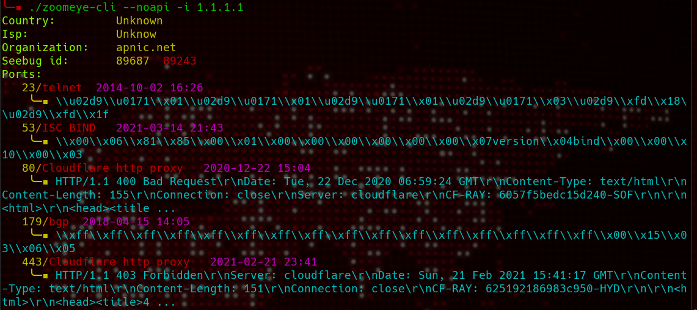

# Zoomeye cli

This can be use with **or** without api key.

For usage without api chrome or chromiu is required (will run in headless mode), It also tke more time (aroude 20/25 seconds)

For the moment you can only search for ip. hostname and cidr search will come later.

## API usages:



#### Init

first add your api key with:

```sh 
zoomeye-cli -init "<API KEY>"

```

API key will be stored in `~/.zoomeye`

#### Info

You can check your credit and role with:

```sh
zoomeye-cli -info
Account: user
Credits: 8559
```

#### Search

(only ip is possible at this time)

```sh
zoomeye-cli -ip <ip>
```


## WIthout API



You need to have chrome or chromium for that, it will use chrome in headless mode.

It still have some bugs sometimes and it's lot longer than with the api (around 20/25seconds).


Noapi add [seebug]("https://www.seebug.org") vuln history.

- green: low
- yellow: medium 
- red: hight

for check details go to "https://www.seebug.org/vuldb/ssvid-<ID>"


#### Search

```
zoomeye-cli -noapi -ip <ip>
```

## Installation

```sh
git clone git@github.com:mmpx12/zoomeye-cli.git
cd zoomeye-cli
go build

#Optionnal
sudo cp zoomeye-cli /usr/bin/zoomeye-cli
```


